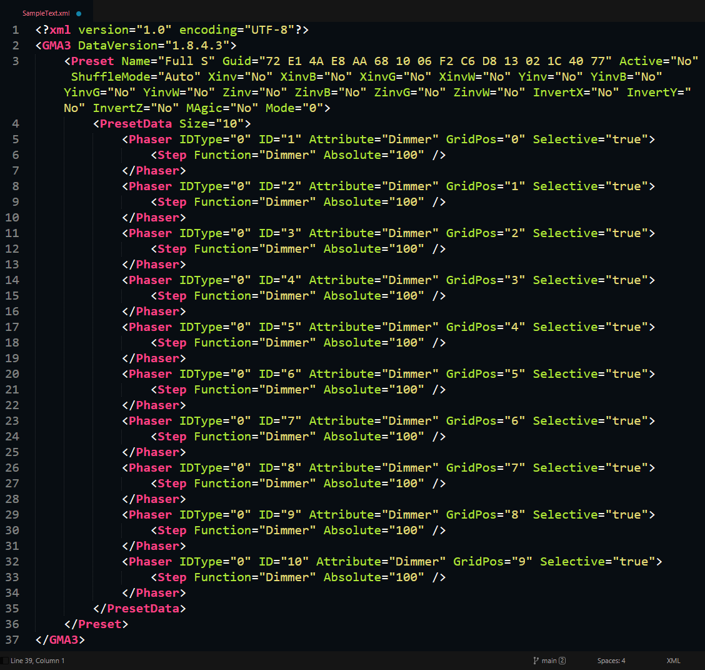
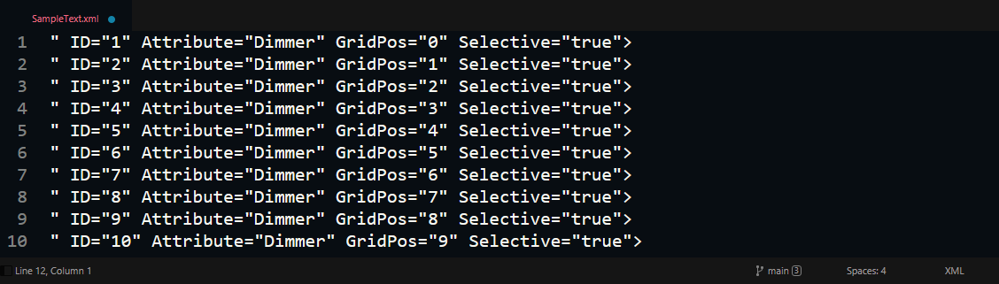
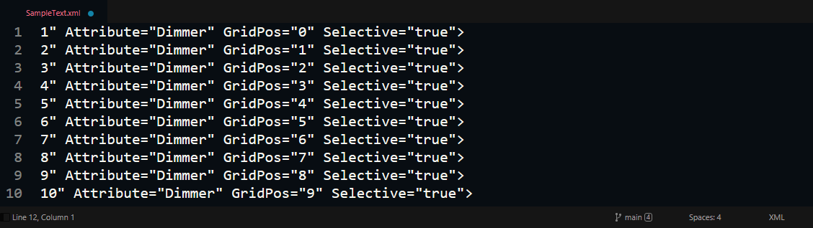
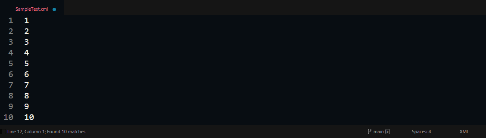

# regex_LC()
The demand for this function came when I realised I couldn't simply do a tab-bit sophisticated regex search pattern on a given file like this one:
```regex
^(?:(?!IDType).)*$\r?\n?
```
In a file [like this one](SampleText.xml), I wanted to select get all the lines that had the text *"IDType"* in it.

The function takes 4 parameters:
* `File_Location`
* `Qualifier`
* `PreText`
* `PostText`

## Sample File:
<p align="center">
    
</p>

## Sample Output of Qualifier:
<p align="center">
    
</p>

## Sample Output of PreText:
<p align="center">
    
</p>

## Sample Output of PostText:
<p align="center">
    
</p>
